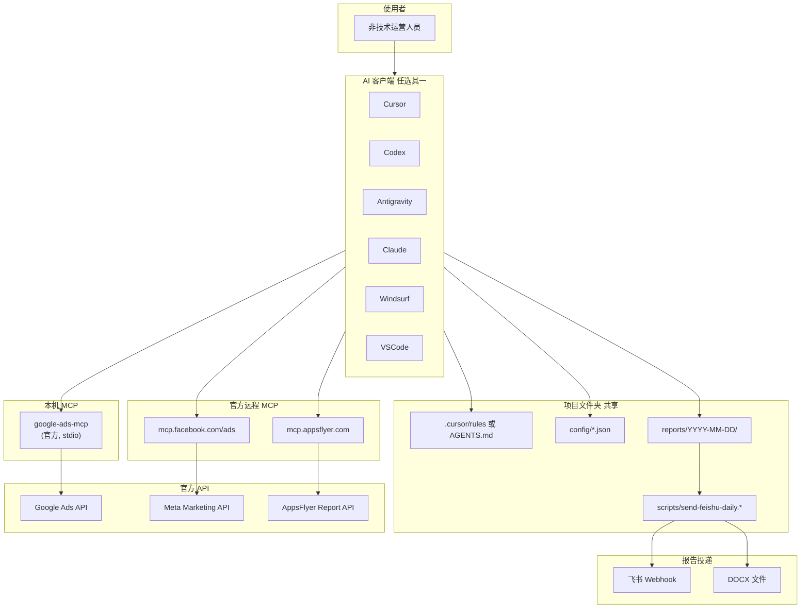

# 系统架构

## 设计原则

1. **只读分析** — 不修改任何广告平台数据
2. **无数据库** — JSON 配置 + 文件报告，非技术人员零运维
3. **多 IDE 兼容** — 同一项目，各 IDE 独立 MCP 配置
4. **官方直连** — 不经 Markifact 等第三方中转

## 架构图



## 数据流（日报）

```
1. Agent 读 config/accounts.json
2. MCP 拉数（Google / Meta / AppsFlyer）
3. 按 field-mapping.json 统一字段名
4. 按 thresholds.json 计算疲劳 & 预算信号
5. 写 reports/{date}/daily-report.md
6. 写 reports/{date}/data-summary.json
7. deliver-report：飞书已配置 → Webhook；否则 → DOCX
```

## 存储说明（无数据库）

| 类型 | 位置 | 说明 |
|------|------|------|
| 原始 JSON | `temp/raw/{date}/{platform}/{category}/` | MCP 拉数，按类别分文件夹 |
| 清洗数据 | `temp/processed/{date}/...` | 对齐后中间文件 |
| 缓存 | `temp/cache/{date}/{platform}/` | 避免重复查询 |
| 日志 | `temp/logs/{date}/` | fetch.log |
| 导出 | `temp/exports/{date}/...` | 可选 CSV |
| 日报 md | `reports/{date}/` | Agent 生成 |
| 缓存 | `cache/`（可选） | 旧版兼容 |

详见 [TEMP-LAYOUT.md](TEMP-LAYOUT.md)。

## IDE 配置隔离

各 IDE 的 MCP 配置安装在**用户目录**，项目内只放模板：

- 项目共享：`config/`、`reports/`、`AGENTS.md`
- IDE 私有：`~/.cursor/`、`~/.codex/`、`~/.gemini/antigravity/` 等

这样同一文件夹可在 Cursor 和 Codex 之间切换，数据不重复。
